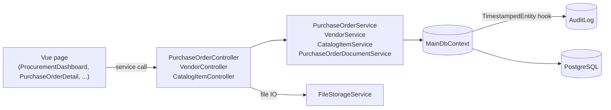

# Procurement (Reference Sample)

> **Status:** `reference-sample`
> **This is not part of your project.** It is a worked example you read, learn from, and then delete.
> **Removable in derived repos:** **yes** — see [`remove.md`](./remove.md)
> **Required by:** nothing

Procurement is the reference sample shipped in App Template. It exists for one reason: to show you a **complete, working vertical slice** so you never have to guess what "the right way to add a feature here" looks like.

It demonstrates end to end: a parent entity (`Vendor`), a child catalog (`CatalogItem`), a workflow entity (`PurchaseOrder` with `Lines`, `Approvals`, `Documents`), full CRUD controllers, services, DTOs, Mapster mappings, Vue pages, frontend services, route configuration, sidebar nav, role bundles, access functions, audit-log integration, file uploads via `PurchaseOrderDocument`, and an approval state machine driven by `EPurchaseOrderStatus`.

## How to use it

1. **Clone the template and run it.** Procurement is already there and already works — click through it and watch a real request go from a Vue page to a controller to the database and back.
2. **Read the code for the layer you're about to write.** Building your first controller? Open `PurchaseOrderController`. Wiring your first page? Open the procurement pages.
3. **Copy the pattern into your own entities**, in your own namespace, with your own vocabulary.
4. **Delete procurement** once your real feature exists. Follow [`remove.md`](./remove.md).

Do not build your project _on top of_ procurement. Build it _beside_ procurement, then remove the sample.

## The seed data is fictional

Every vendor, person, catalog item, and purchase order the seeder creates is **made up**. "Acme Technology Supplies", "Blue Harbour Consulting", "Alice Tan", "Bob Lim" — none of these are real companies or people, and the prices, order numbers, and approval chains are invented for the demo.

That matters for two reasons: it means you can safely show the running app to anyone, and it means **none of this data is a model for what real data looks like**. When you replace the sample, replace the seed with something meaningful for your own domain, or with nothing at all.

## Quick links

- 📁 [`files.md`](./files.md) — exhaustive file map
- ✅❌ [`do-dont.md`](./do-dont.md) — how to use it as a learning surface
- 🎛️ [`customize.md`](./customize.md) — for the rare project that actually IS a procurement system
- 🗑️ [`remove.md`](./remove.md) — how to take it out cleanly
- 🔍 [`verify.md`](./verify.md) — proof the sample still works (for template maintainers)

## Architectural shape

## Patterns this sample teaches

| Pattern                                      | Where to look                                                                                   |
| -------------------------------------------- | ----------------------------------------------------------------------------------------------- |
| Parent/child entity with cascade delete      | `Vendor` ↔ `CatalogItem`; `PurchaseOrder` ↔ `PurchaseOrderLine`                                 |
| Workflow with state machine                  | `PurchaseOrderController.Submit` and `ProcessApproval` driven by `EPurchaseOrderStatus`         |
| Per-feature documents with FK linking entity | `PurchaseOrderDocument` → `Document` (instead of polymorphic `OwnerType`/`OwnerId`)             |
| Mapster nav flattening                       | `MappingProfile.cs` PurchaseOrderDto config                                                     |
| Per-endpoint access function                 | `[RequireAccessFunction(AccessFunctionCodes.Api.ProcurementOrderApprove)]` on `ProcessApproval` |
| Approval chain seeded on submit              | `Submit()` adds the approval rows                                                               |
| Frontend service with form helpers           | `purchaseOrderService.ts`                                                                       |
| Sidebar nav driven by access functions       | `app-config/navigation.ts`                                                                      |
| Keeping a removable feature removable        | the `// === SAMPLE: procurement ... ===` fences in otherwise-shared files                       |
