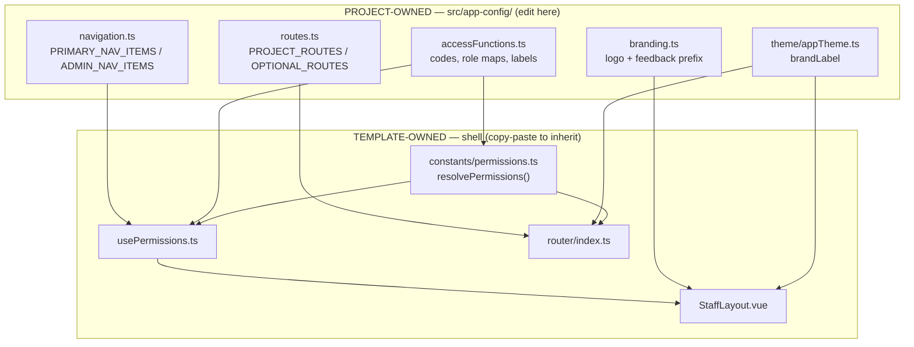

# App Shell & Navigation

> **Status:** `core`
> **Removable in derived repos:** **no** — every page renders inside the staff shell
> **Category:** frontend

The **app shell** is the staff-facing chrome that wraps every page: the sidebar, the top
bar (page title, notifications, profile menu), and the responsive mobile drawer. It is
**data-driven** — it renders whatever menu items, routes, access codes, and brand the
project supplies, without the shell components themselves knowing anything project-specific.

This feature exists to make a hard split explicit:

- **The shell mechanism is template-owned** (locked). You inherit improvements to it by
  copy-pasting the file. See `.ai/common/11-customization-boundary.md`.
- **The project data the shell renders is project-owned** and lives in
  `src/frontend/main/src/app-config/*`. This is the _only_ place you edit to change the
  menu, routes, access codes, role labels, logo, or brand.

Because the locked files hold no project data, a derived repo can paste a newer
`StaffLayout.vue` / `useSidebar.ts` / `router/index.ts` over its own copy and instantly
inherit the upstream improvement — its `app-config/*` is never touched.

## Quick links

- [`files.md`](./files.md) — every file owned and touched by this feature
- [`do-dont.md`](./do-dont.md) — the locked-vs-project rules for the shell
- [`customize.md`](./customize.md) — add a menu item / add a route / rebrand
- [`verify.md`](./verify.md) — prove the shell is data-free and still renders

## Architectural shape

## Key entry points

| Layer         | Path                                                  | Ownership | Purpose                                                                                  |
| ------------- | ----------------------------------------------------- | --------- | ---------------------------------------------------------------------------------------- |
| Shell layout  | `src/frontend/main/src/staff/layouts/StaffLayout.vue` | LOCKED    | Renders sidebar/topbar from `navItems`/`adminNavItems`; brand from theme + `branding.ts` |
| Sidebar state | `src/frontend/main/src/composables/useSidebar.ts`     | LOCKED    | Responsive expand/collapse + breakpoints                                                 |
| Nav filtering | `src/frontend/main/src/composables/usePermissions.ts` | LOCKED    | Filters nav by permission; computes `userRoleLabel`                                      |
| Nav type      | `src/frontend/main/src/composables/navTypes.ts`       | LOCKED    | `NavItem` shape                                                                          |
| Router        | `src/frontend/main/src/router/index.ts`               | LOCKED    | Mounts the shell, applies the permission guard, resolves optional pages                  |
| Resolver      | `src/frontend/main/src/constants/permissions.ts`      | LOCKED    | `resolvePermissions(user, maps)` — project maps injected                                 |
| Menu data     | `src/frontend/main/src/app-config/navigation.ts`      | PROJECT   | The sidebar menu items                                                                   |
| Route data    | `src/frontend/main/src/app-config/routes.ts`          | PROJECT   | The project's routes                                                                     |
| Access data   | `src/frontend/main/src/app-config/accessFunctions.ts` | PROJECT   | Codes, UI permissions, role/permission maps, role labels                                 |
| Brand assets  | `src/frontend/main/src/app-config/branding.ts`        | PROJECT   | Logo + feedback-widget prefix                                                            |
| Brand label   | `src/frontend/main/src/theme/appTheme.ts`             | PROJECT   | `brandLabel` (product name)                                                              |
