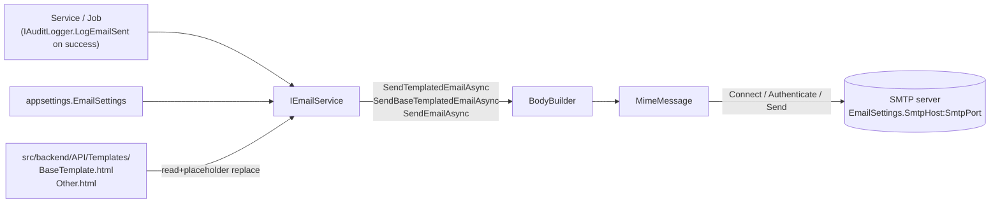

# Email Notifications

> **Status:** `core`
> **Removable in derived repos:** **no** — virtually every workflow has at least one transactional email
> **Required by:** any service that sends email — approval emails, password reset (if implemented), notification fan-out

The email feature is a thin SMTP-based service backed by MailKit. It exposes a single `IEmailService` with overloads for:

- **Templated email** — load an HTML template from `src/backend/API/Templates/`, replace `{Placeholder}` tokens, send.
- **Base-templated email** — wrap arbitrary content HTML inside the shared `BaseTemplate.html` (header / footer / date / year), send.
- **Raw email** — send a pre-built HTML body to one or more `To`s, with optional `Cc` and a configured `Bcc` list.

It supports STARTTLS via `EnableSsl` and SMTP auth via `SmtpUsername` / `SmtpPassword`.

## `SenderEmail` is a required setting

**Set `EmailSettings:SenderEmail` explicitly in every environment.** There is no sensible address the
template can guess for you: the right value depends on which domain you actually control and which
mailbox your SMTP relay is willing to send as.

If you leave it blank, `EmailService` falls back to `<appname>@example.edu` — a placeholder domain
that nobody owns and that no real relay will accept. That fallback exists so a misconfigured dev run
fails visibly rather than silently sending as something plausible. Do not rely on it.

| Environment | What to set                                                                                      |
| ----------- | ------------------------------------------------------------------------------------------------ |
| Development | `SenderEmail: "noreply@localhost"` (or anything) pointed at a **local SMTP catcher** — see below |
| Deployed    | A real mailbox on a domain you control, that your relay is authorised to send as                 |

## Local development: an SMTP catcher, not a real relay

The dev default is a local mail catcher — a fake SMTP server that accepts everything and shows you
the messages in a browser instead of delivering them. [Mailpit](https://mailpit.axllent.org/) is the
recommended one:

```bash
docker run -d --name mailpit -p 1025:1025 -p 8025:8025 axllent/mailpit
```

Point `SmtpHost: "localhost"`, `SmtpPort: 1025`, `EnableSsl: false`, no username or password, and open
`http://localhost:8025` to read whatever your app sent. Nothing leaves your machine, so you can
develop the password-reset flow without emailing strangers.

The service does NOT manage:

- Queues / retries (use `tickerq-background-jobs` for retryable workflows)
- Click tracking (out of scope; if needed, integrate Mailgun / SES)
- Push notifications (see `push-notifications-onesignal`)

## Quick links

- [`files.md`](./files.md) — every file owned and touched by this feature
- [`do-dont.md`](./do-dont.md) — feature-specific rules
- [`customize.md`](./customize.md) — configuring the sender, adding templates, swapping providers, batching
- [`verify.md`](./verify.md) — local SMTP smoke against the mail catcher

## Architectural shape



## Key entry points

| Layer              | Path                                                             | Purpose                                                                                                                                                          |
| ------------------ | ---------------------------------------------------------------- | ---------------------------------------------------------------------------------------------------------------------------------------------------------------- |
| Interface          | `src/backend/Libraries/Services/Services/Email/IEmailService.cs` | The contract: `SendEmailAsync`, `SendEmailWithCCAsync`, `SendTemplatedEmailAsync`, `SendBaseTemplatedEmailAsync` (with single + list overloads)                  |
| Service            | `src/backend/Libraries/Services/Services/Email/EmailService.cs`  | MailKit-based implementation. Loads templates from `{ContentRoot}/Templates/`, replaces `{Placeholder}` tokens, BCCs every message per `EmailSettings.BccEmails` |
| Settings           | `src/backend/Libraries/Shared/Models/EmailSettings.cs`           | `AppName`, `SmtpHost`, `SmtpPort`, `SmtpUsername`, `SmtpPassword`, `SenderEmail` (**set this**), `SenderName`, `EnableSsl`, `BccEmails`                          |
| Base template      | `src/backend/API/Templates/BaseTemplate.html`                    | The shared HTML shell with `{AppName}`, `{Content}`, `{DateTime}`, `{Year}` placeholders. Replace its logo and colours with your project's — see `customize.md`  |
| Per-template files | `src/backend/API/Templates/*.html`                               | Individual templates (e.g. `ApprovalRequest.html`, `PasswordReset.html` if added by the project)                                                                 |
| DI registration    | `src/backend/API/Program.cs` lines 96-103                        | `Configure<EmailSettings>` + scoped `IEmailService` factory that injects `ContentRootPath`                                                                       |
