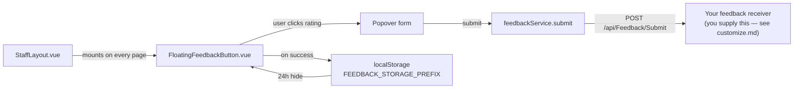

# Feedback Widget

> **Status:** `core`
> **Removable in derived repos:** **yes** — but keep it if you want in-app feedback; it is cheap and it is the fastest way to learn which screens confuse people
> **Required by:** the staff layout (`StaffLayout.vue`) — while present, every authenticated screen renders the floating button

The feedback widget is a thumbs-up / thumbs-down popover anchored at the bottom-right of every authenticated page. The user picks a rating (`1` for negative, `5` for positive), optionally writes free-text feedback, and submits via `POST /api/Feedback/Submit`. Each submission carries a `function_id` (per-page identifier) so submissions can be aggregated by screen, the literal `rating`, the feedback text, and the current `window.location.href` for context.

After a submission, the widget hides itself for 24 hours per `function_id` via `localStorage` to avoid pestering. The widget is mounted inside the global `StaffLayout.vue` so all authenticated pages get it for free; pages do not need to import it. Treat that layout mount as template-owned shell infrastructure; feedback changes belong in feedback-owned components/config or page-local inline feedback.

## You must supply the receiving endpoint

**The template ships the frontend half only.** There is no `FeedbackController` in `src/backend/API/Controllers/` — `feedbackService.submit` posts to `/api/Feedback/Submit`, and until something answers that route, submissions fail. Pick one:

- **Write a small controller** that stores rows in your own table. This is the obvious choice for a project that wants to read its own feedback — see `customize.md` §6.
- **Forward to an external collector** you already run, from a thin proxy controller.
- **Remove the widget** if in-app feedback is not part of your project.

Whichever you pick, do it deliberately. A visible button that silently 404s is worse than no button.

## Namespace the `function_id`

The `function_id` prefix ships as `procurement.` because it follows the bundled procurement reference sample. **Rename it to your own project slug** — it is the key everything aggregates on, so a leftover `procurement.` prefix makes your feedback data confusing to read. See `customize.md` §1.

## Quick links

- [`files.md`](./files.md) — every file owned and touched by this feature
- [`do-dont.md`](./do-dont.md) — feature-specific rules
- [`customize.md`](./customize.md) — change placement, namespace, behavior
- [`verify.md`](./verify.md) — manual click-path verification

## Architectural shape

## Key entry points

| Layer             | Path                                                                                | Purpose                                                                                                                                                                                       |
| ----------------- | ----------------------------------------------------------------------------------- | --------------------------------------------------------------------------------------------------------------------------------------------------------------------------------------------- |
| Page-level button | `src/frontend/main/src/components/feedback/FloatingFeedbackButton.vue`              | The visible widget — handles popover state, rating selection, 24-hour hide via `localStorage`, toast on success, error handling                                                               |
| Composite UI      | `src/frontend/packages/ui/src/components/composite/app-feedback/AppFeedbackHub.vue` | The lower-level visual primitive (rating buttons + textarea + submit), reused by `FloatingFeedbackButton`                                                                                     |
| FE service        | `src/frontend/main/src/services/feedbackService.ts`                                 | The typed axios client. Defines `FeedbackSubmitRequest` (`function_id`, `rating: "1" \| "5"`, `feedback`, `page`) and posts to `/api/Feedback/Submit`                                         |
| Layout mount      | `src/frontend/main/src/staff/layouts/StaffLayout.vue` (lines 12, 67-69, ~1034)      | Imports `FloatingFeedbackButton`, computes `feedbackFunctionId`, renders `<FloatingFeedbackButton :function-id="feedbackFunctionId" />` once near the layout's bottom                         |
| 24-hour storage   | `localStorage` keys `<project-slug>.feedback.submittedAt.<functionId>`              | TTL constant `FEEDBACK_HIDE_TTL_MS = 24 * 60 * 60 * 1000` defined in `FloatingFeedbackButton.vue`. Ships with the `procurement.` prefix from the reference sample — rename it                 |
| Backend endpoint  | `POST /api/Feedback/Submit` — **not shipped, you write it**                         | The template contains no `FeedbackController`. Add one at `src/backend/API/Controllers/FeedbackController.cs` that either stores submissions locally or forwards them to a collector you run. |
