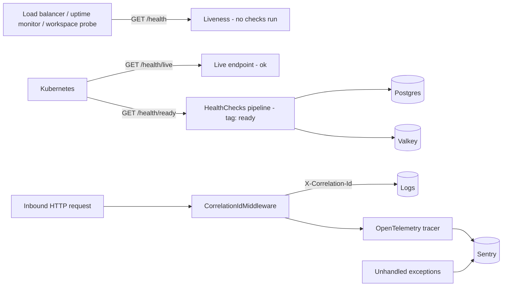

# Health Checks & Observability

> **Status:** `core`
> **Removable in derived repos:** **no** — the `/health` endpoints are what every load balancer, Kubernetes probe, and Docker Compose healthcheck in this template depends on. Sentry + OpenTelemetry are opt-in at runtime (they no-op when no DSN is configured), but leave the wiring in place
> **Required by:** load balancer / Kubernetes probes / Compose healthchecks / uptime monitor / Sentry dashboards

The feature ships three orthogonal concerns:

1. **Health endpoints** — liveness and readiness are deliberately separated. Dependency probes live on
   readiness ONLY; liveness must stay dependency-free.
   - `GET /health` — **liveness.** Registered with `Predicate = _ => false`, so it runs no checks and
     answers 200 whenever the process is up. This is the canonical external uptime endpoint and is what
     the hosted-workspace platform polls (see [`ignite-workspace`](../ignite-workspace/README.md)).
     It must NOT touch Postgres or Valkey — a dependency-aware liveness probe reports the service dead
     while it is merely waiting on a dependency, which parks a workspace at Degraded and fails a
     rolling deploy that is otherwise healthy.
   - `GET /health/ready` — **readiness.** Runs every check tagged `ready` (Postgres + Valkey) via the
     standard ASP.NET HealthChecks builder. Use this for load-balancer pool membership and for
     "is the stack actually usable" smoke tests. Returns 503 while a dependency is down.
   - `GET /health/live` — flat `"ok"` string, no HealthChecks pipeline at all. Kubernetes liveness probe.

   > Registering a new dependency check? Tag it `ready` so it lands on `/health/ready`. Never add it to
   > the `/health` predicate.

2. **Sentry + OpenTelemetry** — `ObservabilityExtensions.AddObservability` wires Sentry's ASP.NET Core integration with OTel ASP.NET, HttpClient, and EF Core instrumentations. Activates only when `Sentry:Dsn` is set; otherwise the call is a no-op so dev environments are quiet.

3. **Correlation ID middleware** — every request gets a correlation ID inserted as `X-Correlation-Id` (header + log scope). The audit log captures this in `AuditLog.CorrelationId`.

The Auth API runs the same Sentry+OTel stack via `Auth/Program.cs:19-42` (mirror of the Main API setup).

## Suggested Sentry project layout

Sentry is entirely optional — with no `Sentry:Dsn` configured, `AddObservability` is a no-op and the app runs fine. If you do use it (the free tier is generous enough for a student project), this layout keeps things legible instead of sprawling:

- `<applicationSlug>-backend` for every backend API in the app.
- `<applicationSlug>-frontend` for every frontend SPA in the app.
- Extra projects only for genuinely separate runtimes (a worker, a second product surface).

Backend APIs share one backend DSN and use `Sentry:ServiceName` / `OpenTelemetry:ServiceName` plus the Sentry `service` tag to tell `api-main` and `api-auth` apart. Frontend apps share one frontend DSN and use tags to distinguish `main` from `login`. Separate environments with `Sentry:Environment` / `sentryEnvironment` rather than by creating extra projects — a project per environment fragments your issue history for no benefit.

## Quick links

- [`files.md`](./files.md) — every file owned and touched by this feature
- [`do-dont.md`](./do-dont.md) — feature-specific rules
- [`customize.md`](./customize.md) — adding health checks, raising sample rate, custom OTel exporters
- [`verify.md`](./verify.md) — endpoint smoke + Sentry capture

## Architectural shape

## Key entry points

| Layer                   | Path                                                                | Purpose                                                                                                  |
| ----------------------- | ------------------------------------------------------------------- | -------------------------------------------------------------------------------------------------------- |
| Boot extension          | `src/backend/API/Extensions/ObservabilityExtensions.cs`             | `builder.AddObservability()` — registers Sentry SDK + OTel tracing for ASP.NET Core, HttpClient, EF Core |
| Health pipeline         | `src/backend/API/Program.cs` lines 74-76                            | `services.AddHealthChecks().AddNpgSql(...).AddRedis(...)`                                                |
| Health endpoints        | `src/backend/API/Program.cs` lines 240-247                          | `MapHealthChecks("/health")`, `MapHealthChecks("/health/ready")`, `MapGet("/health/live", ...)`          |
| Correlation ID          | `src/backend/API/Middleware/CorrelationIdMiddleware.cs`             | First middleware in the pipeline; reads / generates `X-Correlation-Id`                                   |
| Auth-side observability | `src/backend/Auth/Program.cs` lines 19-42                           | Mirror Sentry+OTel setup so Auth traces are captured too                                                 |
| Skip path               | `src/backend/API/Middleware/SessionValidationMiddleware.cs` line 99 | `/health` is in `skipPaths` so probes never need a session                                               |
| Config                  | `src/backend/API/appsettings.json` `Sentry:*`                       | `Dsn`, `Environment`, `TracesSampleRate`, `ServiceName`                                                  |
