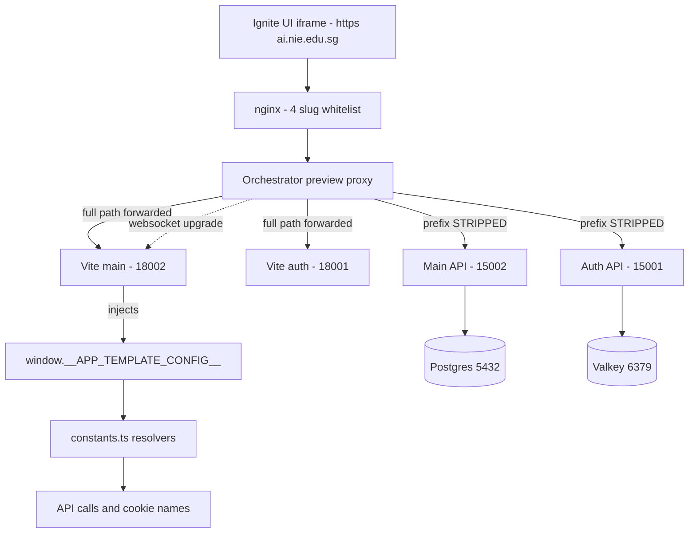

# Ignite Workspace Compatibility

> **Status:** `core`
> **Removable in derived repos:** **no** — this is what makes the project boot, preview and hot-reload inside an NIE Ignite workspace. Every part of it is inert outside a workspace, so there is nothing to gain by removing it
> **Required by:** the Ignite live preview iframe, the Coder `coder_app` healthchecks, the workspace's `run-frontend.sh` / `run-main-api.sh` / `run-auth-api.sh`

**Read [`docs/IGNITE-INTEGRATION.md`](../../../docs/IGNITE-INTEGRATION.md) first if you have never seen Ignite.** This dossier is the agent-facing summary; that document is the full explanation with worked examples.

NIE Ignite runs each student project in a Coder workspace container and shows the running frontend in an **iframe** behind a **path-based reverse proxy**. Inside the container, supervisord keeps five programs alive — `postgres`, `valkey`, `auth-api`, `main-api`, and one `frontend` program that runs **both** Vite dev servers.

The feature ships four orthogonal concerns:

1. **Vite hosted-preview bridge** — `base`, `server.allowedHosts` and `server.hmr` in both `vite.config.ts` files read the `VITE_*` environment the workspace injects. With no such environment every value is undefined and both `pnpm dev` and `vite build` behave exactly as before.
2. **Runtime-config injection** — a dev-server-only plugin (`apply: "serve"`) writes `window.__APP_TEMPLATE_CONFIG__` into the served HTML, handing the app its API URLs, sibling-app URLs and per-workspace cookie names through the template's own runtime-config channel instead of `import.meta.env`.
3. **Runtime-config overrides in `constants.ts`** — optional `AppTemplateRuntimeConfig` fields (`appBasePath`, `mainApiBaseUrl`, `authApiBaseUrl`, `mainAppUrl`, `authAppUrl`, `sessionCookieName`, `userCookieName`, `cookieDomain`) that let a deployment state its URLs as fact instead of letting the first-path-segment heuristic guess.
4. **Dependency-free liveness** — `/health` runs no checks in either API, so the Coder healthcheck reports process liveness and not database availability. `/health/ready` carries the Postgres + Valkey probes.

Plus **`ignite.manifest.json`** at the repo root: the template's own declaration of its topology (frontends, backends, ports, preview slugs, datastores, validation commands, toolchain) for the Ignite contract layer.

## The one rule

The preview proxy forwards the **full mount path** to the two Vite dev servers and **strips the prefix** before the two .NET APIs. So Vite's `base` must equal the mount path, and the APIs must keep serving at the root. Break the first half and the iframe is blank with no HMR; break the second and every API route 404s.

## Quick links

- [`docs/IGNITE-INTEGRATION.md`](../../../docs/IGNITE-INTEGRATION.md) — the full guide (ports, mount URLs, HMR mechanics, troubleshooting)
- [`files.md`](./files.md) — every file owned and touched by this feature
- [`do-dont.md`](./do-dont.md) — the hard rules; read before editing a Vite config or a `Program.cs` health block
- [`customize.md`](./customize.md) — adding a runtime-config key, changing cookie names, adding a health check, overriding the HMR port
- [`verify.md`](./verify.md) — the local Ignite-mount simulation, plus the checks that prove preview + HMR still work

## Architectural shape

## Ports (fixed by the workspace)

| Service       | Workspace port | Preview slug   | Local `pnpm dev` port |
| ------------- | -------------- | -------------- | --------------------- |
| Main frontend | 18002          | `preview-main` | 8002                  |
| Auth frontend | 18001          | `preview-auth` | 8001                  |
| Main API      | 15002          | `main-api`     | 5002                  |
| Auth API      | 15001          | `auth-api`     | 5001                  |
| PostgreSQL    | 5432           | —              | 5432                  |
| Valkey        | 6379           | —              | 6379                  |

There are exactly four preview slugs. They are whitelisted independently in the Ignite `build/nginx.conf` `location` regex and in the orchestrator's `previewAppPorts` map. A fifth service cannot be reached from a browser.

## Key entry points

| Layer                    | Path                                                                                                        | Purpose                                                                                          |
| ------------------------ | ----------------------------------------------------------------------------------------------------------- | ------------------------------------------------------------------------------------------------ |
| Vite base                | `src/frontend/{main,auth}/vite.config.ts` → `basePath` / `base:`                                            | `readEnv("VITE_BASE_PATH") ?? "./"` — the mount path, or the untouched production default        |
| Host allowlist           | `src/frontend/{main,auth}/vite.config.ts` → `configuredAllowedHosts`                                        | Comma-separated `VITE_ALLOWED_HOSTS`, spread in only when non-empty                              |
| HMR                      | `src/frontend/{main,auth}/vite.config.ts` → `resolveHmrOptions()`                                           | Pins `clientPort: 443` behind the TLS edge; honours `VITE_HMR_CLIENT_PORT` / `VITE_HMR_PROTOCOL` |
| Runtime-config injection | `src/frontend/{main,auth}/vite.config.ts` → `hostedPreviewRuntimeConfigPlugin()`                            | Dev-only `transformIndexHtml` head-prepend of `window.__APP_TEMPLATE_CONFIG__`                   |
| Env → config map         | `src/frontend/{main,auth}/vite.config.ts` → `RUNTIME_CONFIG_FROM_ENV`                                       | `VITE_API_URL`→`mainApiBaseUrl`, `VITE_BASE_PATH`→`appBasePath`, …                               |
| Config contract          | `src/frontend/packages/shared/src/config/constants.ts` → `AppTemplateRuntimeConfig`                         | Every optional override, documented per field                                                    |
| URL resolvers            | same file → `getAppBasePath`, `getBackendBaseUrl`, `getBackendUrl`, `getFrontendUrl`, `getFrontendAssetUrl` | Override wins; otherwise the historical heuristic                                                |
| Cookie names             | same file → `FRONTEND_CONSTANTS.cookies`                                                                    | `sessionCookieName` / `userCookieName` overrides, resolved once at module evaluation             |
| Health split             | `src/backend/API/Program.cs`, `src/backend/Auth/Program.cs`                                                 | `/health` (no checks) · `/health/ready` (`"ready"`-tagged) · `/health/live`                      |
| Topology declaration     | `ignite.manifest.json`                                                                                      | Frontends, backends, ports, slugs, datastores, validation, toolchain                             |

## The topology trap

`run-frontend.sh` in the Ignite workspace starts both Vite apps as children of **one** supervisord program, and ends with `wait -n` plus a shared `EXIT` trap that kills the surviving children. **Deleting `src/frontend/auth` therefore also kills the main app**: the auth child dies immediately, the trap kills main, supervisord retries and gives up, `preview-main` never becomes healthy, and the workspace never leaves _Starting_. The same independence problem applies to the two APIs via their separate `coder_app` healthchecks.

The Ignite plan (`docs/plans/2026-07-17-nie-template-std-and-template-contract-layer.md` §1.5) documents this as a verified, critical constraint. **This template keeps both frontends and both backends precisely so it does not hit it.** The 2-frontend / 2-backend topology is REQUIRED until Ignite's contract layer ships generic per-service run scripts.
